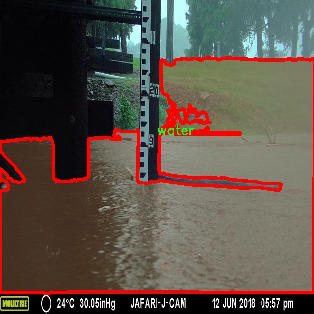

### 1.背景意义

研究背景与意义

水位监测在水资源管理、环境保护和防洪预警等领域具有重要意义。随着全球气候变化和人类活动的影响，水位的变化变得愈加复杂，传统的人工监测方法已难以满足实时性和准确性的要求。因此，基于计算机视觉的自动化水位检测系统应运而生，成为解决这一问题的有效手段。近年来，深度学习技术的快速发展为图像分割和目标检测提供了强大的工具，其中YOLO（You Only Look Once）系列模型因其高效性和准确性而受到广泛关注。

本研究旨在基于改进的YOLOv11模型，开发一个水位刻度检测图像分割系统。该系统将利用包含2400张水位图像的数据集进行训练和验证，数据集中水的类别数量为1，且已进行精确标注。这一数据集的构建不仅为模型的训练提供了丰富的样本，还为后续的模型优化和应用奠定了基础。通过对水位图像的实例分割，系统能够准确识别水位的变化，进而实现对水位的实时监测。

此外，采用YOLOv11模型的改进版本，将在检测速度和精度上进行优化，以适应不同环境下的水位监测需求。该系统的成功实施将有助于提高水位监测的自动化水平，降低人工成本，并为相关领域的研究提供数据支持和技术保障。通过这一研究，我们期望为水资源管理提供更加智能化的解决方案，推动计算机视觉技术在环境监测中的应用，进而促进可持续发展目标的实现。

### 2.视频效果

[2.1 视频效果](https://www.bilibili.com/video/BV1ZdCFY2Eqz/)

### 3.图片效果


##### [项目涉及的源码数据来源链接](https://kdocs.cn/l/cszuIiCKVNis)**

注意：本项目提供训练的数据集和训练教程,由于版本持续更新,暂不提供权重文件（best.pt）,请按照6.训练教程进行训练后实现上图演示的效果。

### 4.数据集信息

##### 4.1 本项目数据集类别数＆类别名

nc: 1
names: ['water']


该项目为【图像分割】数据集，请在【训练教程和Web端加载模型教程（第三步）】这一步的时候按照【图像分割】部分的教程来训练

##### 4.2 本项目数据集信息介绍

本项目数据集信息介绍

本项目旨在改进YOLOv11的水位刻度检测图像分割系统，因此所使用的数据集专注于水体相关的图像数据。该数据集的主题为“water”，其设计旨在提供丰富的水位信息，以便于训练深度学习模型，提升其在水位检测和图像分割任务中的表现。数据集中包含的类别数量为1，具体类别为“water”，这意味着所有图像均围绕水体的不同表现形式展开，确保模型能够准确识别和分割水位刻度。

在数据集的构建过程中，特别注重了图像的多样性和代表性。所收集的图像涵盖了不同环境下的水体场景，包括河流、湖泊、池塘等多种水体类型。这些图像不仅包含不同的水位状态，还考虑了不同的光照条件、天气变化以及季节性因素，以确保模型在各种实际应用场景中的鲁棒性。此外，数据集中还包含了多种角度和距离拍摄的水位刻度图像，进一步丰富了训练数据的多样性。

为了提高模型的泛化能力，数据集中的图像经过精心标注，确保每一幅图像中的水位刻度都被准确地标识出来。这种精确的标注不仅有助于模型学习水位的特征，还能提高其在实际应用中的准确性和可靠性。通过对这一数据集的深入训练，期望能够显著提升YOLOv11在水位刻度检测和图像分割任务中的性能，使其能够在实际应用中更好地服务于水资源管理、环境监测等领域。





### 5.全套项目环境部署视频教程（零基础手把手教学）

[5.1 所需软件PyCharm和Anaconda安装教程（第一步）](https://www.bilibili.com/video/BV1BoC1YCEKi/?spm_id_from=333.999.0.0&vd_source=bc9aec86d164b67a7004b996143742dc)


[5.2 安装Python虚拟环境创建和依赖库安装视频教程（第二步）](https://www.bilibili.com/video/BV1ZoC1YCEBw?spm_id_from=333.788.videopod.sections&vd_source=bc9aec86d164b67a7004b996143742dc)

### 6.改进YOLOv11训练教程和Web_UI前端加载模型教程（零基础手把手教学）

[6.1 改进YOLOv11训练教程和Web_UI前端加载模型教程（第三步）](https://www.bilibili.com/video/BV1BoC1YCEhR?spm_id_from=333.788.videopod.sections&vd_source=bc9aec86d164b67a7004b996143742dc)


按照上面的训练视频教程链接加载项目提供的数据集，运行train.py即可开始训练



     Epoch   gpu_mem       box       obj       cls    labels  img_size
     1/200     20.8G   0.01576   0.01955  0.007536        22      1280: 100%|██████████| 849/849 [14:42<00:00,  1.04s/it]
               Class     Images     Labels          P          R     mAP@.5 mAP@.5:.95: 100%|██████████| 213/213 [01:14<00:00,  2.87it/s]
                 all       3395      17314      0.994      0.957      0.0957      0.0843

     Epoch   gpu_mem       box       obj       cls    labels  img_size
     2/200     20.8G   0.01578   0.01923  0.007006        22      1280: 100%|██████████| 849/849 [14:44<00:00,  1.04s/it]
               Class     Images     Labels          P          R     mAP@.5 mAP@.5:.95: 100%|██████████| 213/213 [01:12<00:00,  2.95it/s]
                 all       3395      17314      0.996      0.956      0.0957      0.0845

     Epoch   gpu_mem       box       obj       cls    labels  img_size
     3/200     20.8G   0.01561    0.0191  0.006895        27      1280: 100%|██████████| 849/849 [10:56<00:00,  1.29it/s]
               Class     Images     Labels          P          R     mAP@.5 mAP@.5:.95: 100%|███████   | 187/213 [00:52<00:00,  4.04it/s]
                 all       3395      17314      0.996      0.957      0.0957      0.0845


###### [项目数据集下载链接](https://kdocs.cn/l/cszuIiCKVNis)

### 7.原始YOLOv11算法讲解

##### YOLO11简介

> YOLO11源码地址：https://github.com/ultralytics/ultralytics

Ultralytics
YOLO11是一款尖端的、最先进的模型，它在之前YOLO版本成功的基础上进行了构建，并引入了新功能和改进，以进一步提升性能和灵活性。YOLO11设计快速、准确且易于使用，使其成为各种物体检测和跟踪、实例分割、图像分类以及姿态估计任务的绝佳选择。  


**YOLO11创新点如下:**

YOLO 11主要改进包括：  
`增强的特征提取`：YOLO 11采用了改进的骨干和颈部架构，增强了特征提取功能，以实现更精确的目标检测。  
`优化的效率和速度`：优化的架构设计和优化的训练管道提供更快的处理速度，同时保持准确性和性能之间的平衡。  
`更高的精度，更少的参数`：YOLO11m在COCO数据集上实现了更高的平均精度（mAP），参数比YOLOv8m少22%，使其在不影响精度的情况下提高了计算效率。  
`跨环境的适应性`：YOLO 11可以部署在各种环境中，包括边缘设备、云平台和支持NVIDIA GPU的系统。  
`广泛的支持任务`：YOLO 11支持各种计算机视觉任务，如对象检测、实例分割、图像分类、姿态估计和面向对象检测（OBB）。

**YOLO11不同模型尺寸信息：**

YOLO11 提供5种不同的型号规模模型，以满足不同的应用需求：

Model| size (pixels)| mAPval 50-95| Speed CPU ONNX (ms)| Speed T4 TensorRT10
(ms)| params (M)| FLOPs (B)  
---|---|---|---|---|---|---  
YOLO11n| 640| 39.5| 56.1 ± 0.8| 1.5 ± 0.0| 2.6| 6.5  
YOLO11s| 640| 47.0| 90.0 ± 1.2| 2.5 ± 0.0| 9.4| 21.5  
YOLO11m| 640| 51.5| 183.2 ± 2.0| 4.7 ± 0.1| 20.1| 68.0  
YOLO11l| 640| 53.4| 238.6 ± 1.4| 6.2 ± 0.1| 25.3| 86.9  
YOLO11x| 640| 54.7| 462.8 ± 6.7| 11.3 ± 0.2| 56.9| 194.9  
  
**模型常用训练超参数参数说明：**  
`YOLOv11
模型的训练设置包括训练过程中使用的各种超参数和配置`。这些设置会影响模型的性能、速度和准确性。关键的训练设置包括批量大小、学习率、动量和权重衰减。此外，优化器、损失函数和训练数据集组成的选择也会影响训练过程。对这些设置进行仔细的调整和实验对于优化性能至关重要。  
**以下是一些常用的模型训练参数和说明：**

参数名| 默认值| 说明  
---|---|---  
`model`| `None`| 指定用于训练的模型文件。接受指向 `.pt` 预训练模型或 `.yaml`
配置文件。对于定义模型结构或初始化权重至关重要。  
`data`| `None`| 数据集配置文件的路径（例如
`coco8.yaml`).该文件包含特定于数据集的参数，包括训练数据和验证数据的路径、类名和类数。  
`epochs`| `100`| 训练总轮数。每个epoch代表对整个数据集进行一次完整的训练。调整该值会影响训练时间和模型性能。  
`patience`| `100`| 在验证指标没有改善的情况下，提前停止训练所需的epoch数。当性能趋于平稳时停止训练，有助于防止过度拟合。  
`batch`| `16`| 批量大小，有三种模式:设置为整数(例如，’ Batch =16 ‘)， 60% GPU内存利用率的自动模式(’ Batch
=-1 ‘)，或指定利用率分数的自动模式(’ Batch =0.70 ')。  
`imgsz`| `640`| 用于训练的目标图像尺寸。所有图像在输入模型前都会被调整到这一尺寸。影响模型精度和计算复杂度。  
`device`| `None`| 指定用于训练的计算设备：单个 GPU (`device=0`）、多个 GPU (`device=0,1`)、CPU
(`device=cpu`)，或苹果芯片的 MPS (`device=mps`).  
`workers`| `8`| 加载数据的工作线程数（每 `RANK` 多 GPU 训练）。影响数据预处理和输入模型的速度，尤其适用于多 GPU 设置。  
`name`| `None`| 训练运行的名称。用于在项目文件夹内创建一个子目录，用于存储训练日志和输出结果。  
`pretrained`| `True`| 决定是否从预处理模型开始训练。可以是布尔值，也可以是加载权重的特定模型的字符串路径。提高训练效率和模型性能。  
`optimizer`| `'auto'`| 为训练模型选择优化器。选项包括 `SGD`, `Adam`, `AdamW`, `NAdam`,
`RAdam`, `RMSProp` 等，或 `auto` 用于根据模型配置进行自动选择。影响收敛速度和稳定性  
`lr0`| `0.01`| 初始学习率（即 `SGD=1E-2`, `Adam=1E-3`) .调整这个值对优化过程至关重要，会影响模型权重的更新速度。  
`lrf`| `0.01`| 最终学习率占初始学习率的百分比 = (`lr0 * lrf`)，与调度程序结合使用，随着时间的推移调整学习率。  


**各损失函数作用说明：**  
`定位损失box_loss`：预测框与标定框之间的误差（GIoU），越小定位得越准；  
`分类损失cls_loss`：计算锚框与对应的标定分类是否正确，越小分类得越准；  
`动态特征损失（dfl_loss）`：DFLLoss是一种用于回归预测框与目标框之间距离的损失函数。在计算损失时，目标框需要缩放到特征图尺度，即除以相应的stride，并与预测的边界框计算Ciou
Loss，同时与预测的anchors中心点到各边的距离计算回归DFLLoss。  


### 8.200+种全套改进YOLOV11创新点原理讲解

#### 8.1 200+种全套改进YOLOV11创新点原理讲解大全

由于篇幅限制，每个创新点的具体原理讲解就不全部展开，具体见下列网址中的改进模块对应项目的技术原理博客网址【Blog】（创新点均为模块化搭建，原理适配YOLOv5~YOLOv11等各种版本）

[改进模块技术原理博客【Blog】网址链接](https://gitee.com/qunmasj/good)


#### 8.2 精选部分改进YOLOV11创新点原理讲解

###### 这里节选部分改进创新点展开原理讲解(完整的改进原理见上图和[改进模块技术原理博客链接](https://gitee.com/qunmasj/good)【如果此小节的图加载失败可以通过CSDN或者Github搜索该博客的标题访问原始博客，原始博客图片显示正常】


### YOLO-MS简介
实时目标检测，以YOLO系列为例，已在工业领域中找到重要应用，特别是在边缘设备（如无人机和机器人）中。与之前的目标检测器不同，实时目标检测器旨在在速度和准确性之间追求最佳平衡。为了实现这一目标，提出了大量的工作：从第一代DarkNet到CSPNet，再到最近的扩展ELAN，随着性能的快速增长，实时目标检测器的架构经历了巨大的变化。

尽管性能令人印象深刻，但在不同尺度上识别对象仍然是实时目标检测器面临的基本挑战。这促使作者设计了一个强大的编码器架构，用于学习具有表现力的多尺度特征表示。具体而言，作者从两个新的角度考虑为实时目标检测编码多尺度特征：

从局部视角出发，作者设计了一个具有简单而有效的分层特征融合策略的MS-Block。受到Res2Net的启发，作者在MS-Block中引入了多个分支来进行特征提取，但不同的是，作者使用了一个带有深度卷积的 Inverted Bottleneck Block块，以实现对大Kernel的高效利用。

从全局视角出发，作者提出随着网络加深逐渐增加卷积的Kernel-Size。作者在浅层使用小Kernel卷积来更高效地处理高分辨率特征。另一方面，在深层中，作者采用大Kernel卷积来捕捉广泛的信息。

基于以上设计原则，作者呈现了作者的实时目标检测器，称为YOLO-MS。为了评估作者的YOLO-MS的性能，作者在MS COCO数据集上进行了全面的实验。还提供了与其他最先进方法的定量比较，以展示作者方法的强大性能。如图1所示，YOLO-MS在计算性能平衡方面优于其他近期的实时目标检测器。


具体而言，YOLO-MS-XS在MS COCO上获得了43%+的AP得分，仅具有450万个可学习参数和8.7亿个FLOPs。YOLO-MS-S和YOLO-MS分别获得了46%+和51%+的AP，可学习参数分别为810万和2220万。此外，作者的工作还可以作为其他YOLO模型的即插即用模块。通常情况下，作者的方法可以将YOLOv11的AP从37%+显著提高到40%+，甚至还可以使用更少的参数和FLOPs。


#### Multi-Scale Building Block Design
CSP Block是一个基于阶段级梯度路径的网络，平衡了梯度组合和计算成本。它是广泛应用于YOLO系列的基本构建块。已经提出了几种变体，包括YOLOv4和YOLOv11中的原始版本，Scaled YOLOv4中的CSPVoVNet，YOLOv11中的ELAN，以及RTMDet中提出的大Kernel单元。作者在图2(a)和图2(b)中分别展示了原始CSP块和ELAN的结构。


上述实时检测器中被忽视的一个关键方面是如何在基本构建块中编码多尺度特征。其中一个强大的设计原则是Res2Net，它聚合了来自不同层次的特征以增强多尺度表示。然而，这一原则并没有充分探索大Kernel卷积的作用，而大Kernel卷积已经在基于CNN的视觉识别任务模型中证明有效。将大Kernel卷积纳入Res2Net的主要障碍在于它们引入的计算开销，因为构建块采用了标准卷积。在作者的方法中，作者提出用 Inverted Bottleneck Block替代标准的3 × 3卷积，以享受大Kernel卷积的好处。

基于前面的分析，作者提出了一个带有分层特征融合策略的全新Block，称为MS-Block，以增强实时目标检测器在提取多尺度特征时的能力，同时保持快速的推理速度。

MS-Block的具体结构如图2(c)所示。假设是输入特征。通过1×1卷积的转换后，X的通道维度增加到n*C。然后，作者将X分割成n个不同的组，表示为，其中。为了降低计算成本，作者选择n为3。

注意，除了之外，每个其他组都经过一个 Inverted Bottleneck Block层，用表示，其中k表示Kernel-Size，以获得。的数学表示如下：


根据这个公式，该博客的作者不将 Inverted Bottleneck Block层连接，使其作为跨阶段连接，并保留来自前面层的信息。最后，作者将所有分割连接在一起，并应用1×1卷积来在所有分割之间进行交互，每个分割都编码不同尺度的特征。当网络加深时，这个1×1卷积也用于调整通道数。

#### Heterogeneous Kernel Selection Protocol
除了构建块的设计外，作者还从宏观角度探讨了卷积的使用。之前的实时目标检测器在不同的编码器阶段采用了同质卷积（即具有相同Kernel-Size的卷积），但作者认为这不是提取多尺度语义信息的最佳选项。

在金字塔结构中，从检测器的浅阶段提取的高分辨率特征通常用于捕捉细粒度语义，将用于检测小目标。相反，来自网络较深阶段的低分辨率特征用于捕捉高级语义，将用于检测大目标。如果作者在所有阶段都采用统一的小Kernel卷积，深阶段的有效感受野（ERF）将受到限制，影响大目标的性能。在每个阶段中引入大Kernel卷积可以帮助解决这个问题。然而，具有大的ERF的大Kernel可以编码更广泛的区域，这增加了在小目标外部包含噪声信息的概率，并且降低了推理速度。

在这项工作中，作者建议在不同阶段中采用异构卷积，以帮助捕获更丰富的多尺度特征。具体来说，在编码器的第一个阶段中，作者采用最小Kernel卷积，而最大Kernel卷积位于最后一个阶段。随后，作者逐步增加中间阶段的Kernel-Size，使其与特征分辨率的增加保持一致。这种策略允许提取细粒度和粗粒度的语义信息，增强了编码器的多尺度特征表示能力。

正如图所示，作者将k的值分别分配给编码器中的浅阶段到深阶段，取值为3、5、7和9。作者将其称为异构Kernel选择（HKS）协议。


作者的HKS协议能够在深层中扩大感受野，而不会对浅层产生任何其他影响。此外，HKS不仅有助于编码更丰富的多尺度特征，还确保了高效的推理。

如表1所示，将大Kernel卷积应用于高分辨率特征会产生较高的计算开销。然而，作者的HKS协议在低分辨率特征上采用大Kernel卷积，从而与仅使用大Kernel卷积相比，大大降低了计算成本。


在实践中，作者经验性地发现，采用HKS协议的YOLO-MS的推理速度几乎与仅使用深度可分离的3 × 3卷积相同。

#### Architecture
如图所示，作者模型的Backbone由4个阶段组成，每个阶段后面跟随1个步长为2的3 × 3卷积进行下采样。在第3个阶段后，作者添加了1个SPP块，与RTMDet中一样。在作者的编码器上，作者使用PAFPN作为Neck来构建特征金字塔[31, 35]。它融合了从Backbone不同阶段提取的多尺度特征。Neck中使用的基本构建块也是作者的MS-Block，在其中使用3 × 3深度可分离卷积进行快速推理。

此外，为了在速度和准确性之间取得更好的平衡，作者将Backbone中多级特征的通道深度减半。作者提供了3个不同尺度的YOLO-MS变体，即YOLO-MS-XS、YOLO-MS-S和YOLO-MS。不同尺度的YOLO-MS的详细配置列在表2中。对于YOLO-MS的其他部分，作者将其保持与RTMDet相同。


### 9.系统功能展示

图9.1.系统支持检测结果表格显示

  图9.2.系统支持置信度和IOU阈值手动调节

  图9.3.系统支持自定义加载权重文件best.pt(需要你通过步骤5中训练获得)

  图9.4.系统支持摄像头实时识别

  图9.5.系统支持图片识别

  图9.6.系统支持视频识别

  图9.7.系统支持识别结果文件自动保存

  图9.8.系统支持Excel导出检测结果数据


### 10. YOLOv11核心改进源码讲解

#### 10.1 kan_conv.py

以下是经过精简和注释的核心代码部分，保留了主要功能并进行了详细的中文注释：

```python
import torch
import torch.nn as nn

class KANConvNDLayer(nn.Module):
    def __init__(self, conv_class, norm_class, input_dim, output_dim, spline_order, kernel_size,
                 groups=1, padding=0, stride=1, dilation=1,
                 ndim: int = 2, grid_size=5, base_activation=nn.GELU, grid_range=[-1, 1], dropout=0.0):
        super(KANConvNDLayer, self).__init__()
        
        # 初始化参数
        self.inputdim = input_dim
        self.outdim = output_dim
        self.spline_order = spline_order
        self.kernel_size = kernel_size
        self.padding = padding
        self.stride = stride
        self.dilation = dilation
        self.groups = groups
        self.ndim = ndim
        self.grid_size = grid_size
        self.base_activation = base_activation()  # 基础激活函数
        self.grid_range = grid_range

        # 初始化 dropout
        self.dropout = nn.Dropout2d(p=dropout) if dropout > 0 else None

        # 检查 groups 参数
        if groups <= 0 or input_dim % groups != 0 or output_dim % groups != 0:
            raise ValueError('groups must be a positive integer and input/output dimensions must be divisible by groups')

        # 创建基础卷积层和样条卷积层
        self.base_conv = nn.ModuleList([conv_class(input_dim // groups, output_dim // groups, kernel_size, stride, padding, dilation, groups=1, bias=False) for _ in range(groups)])
        self.spline_conv = nn.ModuleList([conv_class((grid_size + spline_order) * input_dim // groups, output_dim // groups, kernel_size, stride, padding, dilation, groups=1, bias=False) for _ in range(groups)])
        
        # 创建归一化层和激活层
        self.layer_norm = nn.ModuleList([norm_class(output_dim // groups) for _ in range(groups)])
        self.prelus = nn.ModuleList([nn.PReLU() for _ in range(groups)])

        # 生成网格用于样条计算
        h = (self.grid_range[1] - self.grid_range[0]) / grid_size
        self.grid = torch.linspace(self.grid_range[0] - h * spline_order, self.grid_range[1] + h * spline_order, grid_size + 2 * spline_order + 1, dtype=torch.float32)

        # 初始化卷积层权重
        for conv_layer in self.base_conv:
            nn.init.kaiming_uniform_(conv_layer.weight, nonlinearity='linear')
        for conv_layer in self.spline_conv:
            nn.init.kaiming_uniform_(conv_layer.weight, nonlinearity='linear')

    def forward_kan(self, x, group_index):
        # 基础卷积层的前向传播
        base_output = self.base_conv[group_index](self.base_activation(x))

        # 扩展维度以进行样条计算
        x_uns = x.unsqueeze(-1)
        target = x.shape[1:] + self.grid.shape
        grid = self.grid.view(*([1] * (self.ndim + 1) + [-1])).expand(target).contiguous().to(x.device)

        # 计算样条基
        bases = ((x_uns >= grid[..., :-1]) & (x_uns < grid[..., 1:])).to(x.dtype)

        # 计算多阶样条基
        for k in range(1, self.spline_order + 1):
            left_intervals = grid[..., :-(k + 1)]
            right_intervals = grid[..., k:-1]
            delta = torch.where(right_intervals == left_intervals, torch.ones_like(right_intervals), right_intervals - left_intervals)
            bases = ((x_uns - left_intervals) / delta * bases[..., :-1]) + ((grid[..., k + 1:] - x_uns) / (grid[..., k + 1:] - grid[..., 1:(-k)]) * bases[..., 1:])
        
        bases = bases.contiguous().moveaxis(-1, 2).flatten(1, 2)
        spline_output = self.spline_conv[group_index](bases)

        # 结合基础输出和样条输出
        x = self.prelus[group_index](self.layer_norm[group_index](base_output + spline_output))

        # 应用 dropout
        if self.dropout is not None:
            x = self.dropout(x)

        return x

    def forward(self, x):
        # 将输入按组分割并进行前向传播
        split_x = torch.split(x, self.inputdim // self.groups, dim=1)
        output = []
        for group_ind, _x in enumerate(split_x):
            y = self.forward_kan(_x.clone(), group_ind)
            output.append(y.clone())
        y = torch.cat(output, dim=1)
        return y
```

### 主要功能
1. **初始化**：构造函数中初始化卷积层、归一化层、激活函数和样条网格。
2. **前向传播**：`forward_kan`方法计算基础卷积和样条卷积的输出，并结合它们。
3. **组处理**：`forward`方法将输入分成多个组，分别进行处理，然后合并输出。

### 关键点
- 使用了可配置的卷积类型和归一化类型。
- 支持多维卷积（1D、2D、3D）。
- 通过样条基函数增强卷积层的表达能力。

这个文件定义了一个名为 `KANConvNDLayer` 的神经网络层，主要用于实现一种新的卷积操作，结合了基础卷积和样条卷积的特性。该层支持多维卷积（1D、2D、3D），并且可以通过不同的参数进行配置。

在 `KANConvNDLayer` 的构造函数中，首先定义了一些输入参数，包括输入和输出维度、卷积核大小、样条阶数、分组数、填充、步幅、扩张、网格大小、基础激活函数、网格范围和 dropout 概率等。构造函数会检查一些参数的有效性，比如分组数必须为正整数，输入和输出维度必须能被分组数整除。

接下来，初始化了基础卷积层和样条卷积层，使用 `nn.ModuleList` 来存储多个卷积层以支持分组卷积。每个卷积层的权重使用 Kaiming 均匀分布进行初始化，以便在训练开始时获得更好的性能。

`forward_kan` 方法是该层的核心计算逻辑。它首先对输入应用基础激活函数，然后通过基础卷积层进行线性变换。接着，方法计算样条基函数，这涉及到将输入扩展维度并计算样条基的值。样条基的计算基于输入值和预定义的网格，通过一系列条件和插值操作来实现。最终，样条卷积的输出与基础卷积的输出相加，并通过层归一化和 PReLU 激活函数进行处理，最后如果设置了 dropout，则应用 dropout。

`forward` 方法负责处理输入数据。它将输入按组分割，并对每个组调用 `forward_kan` 方法，最后将所有组的输出拼接在一起返回。

此外，文件中还定义了三个具体的卷积层类：`KANConv1DLayer`、`KANConv2DLayer` 和 `KANConv3DLayer`，分别用于一维、二维和三维卷积。这些类通过调用 `KANConvNDLayer` 的构造函数，并传入相应的卷积和归一化类（如 `nn.Conv1d`、`nn.Conv2d` 和 `nn.Conv3d`），实现了特定维度的卷积操作。

总的来说，这个文件实现了一种灵活且强大的卷积层，能够结合传统卷积和样条插值的优点，适用于多种深度学习任务。

#### 10.2 rmt.py

以下是经过简化和注释的核心代码部分，主要保留了模型的结构和重要功能：

```python
import torch
import torch.nn as nn
import torch.nn.functional as F

class DWConv2d(nn.Module):
    """ 深度可分离卷积层 """
    def __init__(self, dim, kernel_size, stride, padding):
        super().__init__()
        # 使用groups参数实现深度可分离卷积
        self.conv = nn.Conv2d(dim, dim, kernel_size, stride, padding, groups=dim)

    def forward(self, x: torch.Tensor):
        """ 前向传播 """
        x = x.permute(0, 3, 1, 2)  # 转换为 (b, c, h, w) 格式
        x = self.conv(x)  # 进行卷积操作
        x = x.permute(0, 2, 3, 1)  # 转换回 (b, h, w, c) 格式
        return x

class FeedForwardNetwork(nn.Module):
    """ 前馈神经网络 """
    def __init__(self, embed_dim, ffn_dim, activation_fn=F.gelu, dropout=0.0):
        super().__init__()
        self.fc1 = nn.Linear(embed_dim, ffn_dim)  # 第一层线性变换
        self.fc2 = nn.Linear(ffn_dim, embed_dim)  # 第二层线性变换
        self.dropout = nn.Dropout(dropout)  # dropout层
        self.activation_fn = activation_fn  # 激活函数

    def forward(self, x: torch.Tensor):
        """ 前向传播 """
        x = self.fc1(x)  # 线性变换
        x = self.activation_fn(x)  # 激活函数
        x = self.dropout(x)  # dropout
        x = self.fc2(x)  # 线性变换
        return x

class MaSA(nn.Module):
    """ 多头自注意力机制 """
    def __init__(self, embed_dim, num_heads):
        super().__init__()
        self.q_proj = nn.Linear(embed_dim, embed_dim)  # 查询向量线性变换
        self.k_proj = nn.Linear(embed_dim, embed_dim)  # 键向量线性变换
        self.v_proj = nn.Linear(embed_dim, embed_dim)  # 值向量线性变换
        self.out_proj = nn.Linear(embed_dim, embed_dim)  # 输出线性变换

    def forward(self, x: torch.Tensor, rel_pos):
        """ 前向传播 """
        q = self.q_proj(x)  # 计算查询向量
        k = self.k_proj(x)  # 计算键向量
        v = self.v_proj(x)  # 计算值向量
        
        # 计算注意力权重
        attn_weights = torch.matmul(q, k.transpose(-2, -1)) + rel_pos
        attn_weights = F.softmax(attn_weights, dim=-1)  # softmax归一化
        
        # 计算输出
        output = torch.matmul(attn_weights, v)
        output = self.out_proj(output)  # 输出线性变换
        return output

class BasicLayer(nn.Module):
    """ 基础层，包含多头自注意力和前馈网络 """
    def __init__(self, embed_dim, num_heads, ffn_dim):
        super().__init__()
        self.attention = MaSA(embed_dim, num_heads)  # 自注意力层
        self.ffn = FeedForwardNetwork(embed_dim, ffn_dim)  # 前馈网络
        self.norm1 = nn.LayerNorm(embed_dim)  # 层归一化
        self.norm2 = nn.LayerNorm(embed_dim)  # 层归一化

    def forward(self, x: torch.Tensor):
        """ 前向传播 """
        x = x + self.attention(self.norm1(x), None)  # 残差连接
        x = x + self.ffn(self.norm2(x))  # 残差连接
        return x

class VisRetNet(nn.Module):
    """ 主模型类 """
    def __init__(self, in_chans=3, num_classes=1000, embed_dims=[96, 192, 384, 768], depths=[2, 2, 6, 2], num_heads=[3, 6, 12, 24]):
        super().__init__()
        self.patch_embed = nn.Conv2d(in_chans, embed_dims[0], kernel_size=4, stride=4)  # 图像分块嵌入
        self.layers = nn.ModuleList()  # 存储各层

        # 构建各层
        for i in range(len(depths)):
            layer = BasicLayer(embed_dims[i], num_heads[i], embed_dims[i] * 4)  # 创建基础层
            self.layers.append(layer)

    def forward(self, x: torch.Tensor):
        """ 前向传播 """
        x = self.patch_embed(x)  # 图像嵌入
        for layer in self.layers:
            x = layer(x)  # 通过每一层
        return x

# 示例模型创建
def RMT_T():
    model = VisRetNet(
        embed_dims=[64, 128, 256, 512],
        depths=[2, 2, 8, 2],
        num_heads=[4, 4, 8, 16]
    )
    return model

if __name__ == '__main__':
    model = RMT_T()  # 创建模型
    inputs = torch.randn((1, 3, 640, 640))  # 随机输入
    res = model(inputs)  # 前向传播
    print(res.size())  # 输出结果的尺寸
```

### 代码说明：
1. **DWConv2d**: 实现深度可分离卷积，用于减少模型参数。
2. **FeedForwardNetwork**: 实现前馈神经网络，包含线性变换和激活函数。
3. **MaSA**: 实现多头自注意力机制，计算查询、键、值的线性变换，并计算注意力输出。
4. **BasicLayer**: 组合自注意力和前馈网络，使用残差连接和层归一化。
5. **VisRetNet**: 主模型类，构建图像嵌入和多个基础层。
6. **RMT_T**: 示例函数，创建一个小型的视觉模型。

这个程序文件`rmt.py`实现了一个视觉变换器（Vision Transformer）模型，名为`VisRetNet`，并提供了不同规模的模型构建函数（如`RMT_T`、`RMT_S`、`RMT_B`和`RMT_L`）。该模型主要用于图像处理任务，特别是在计算机视觉领域。

文件中首先导入了必要的库，包括PyTorch和一些相关的模块。接着定义了一些基本的类，这些类构成了模型的核心组件。

`DWConv2d`类实现了深度可分离卷积，主要用于特征提取。`RelPos2d`类用于生成二维相对位置编码，这在处理图像时可以帮助模型更好地理解空间关系。`MaSAd`和`MaSA`类实现了不同类型的自注意力机制，分别用于处理具有不同保留策略的输入特征。

`FeedForwardNetwork`类实现了前馈神经网络，包含两个线性层和激活函数，用于对输入特征进行非线性变换。`RetBlock`类则是一个残差块，结合了自注意力机制和前馈网络，并通过层归一化和DropPath进行正则化。

`PatchMerging`类用于将输入特征图进行下采样，合并相邻的特征块。`BasicLayer`类则是构建一个基本的变换器层，包含多个残差块和可选的下采样层。

`LayerNorm2d`类实现了二维层归一化，`PatchEmbed`类用于将输入图像分割成小块并进行嵌入。最后，`VisRetNet`类是整个模型的主体，负责将输入图像通过多个变换器层进行处理，并输出特征。

在模型的构造函数中，定义了不同层的参数，包括嵌入维度、深度、头数等，并通过循环构建多个基本层。模型的前向传播方法将输入图像通过嵌入层和多个变换器层，最终返回不同尺度的特征图。

文件末尾定义了四个函数（`RMT_T`、`RMT_S`、`RMT_B`、`RMT_L`），用于创建不同规模的`VisRetNet`模型。每个函数都指定了不同的嵌入维度、层数和头数等参数。

最后，在`__main__`部分，创建了一个`RMT_T`模型实例，并生成一个随机输入进行测试，输出每个特征图的尺寸。这段代码可以用于验证模型的构建是否正确，以及模型在给定输入下的输出形状。

#### 10.3 TransNext.py

以下是代码中最核心的部分，并附上详细的中文注释：

```python
try:
    # 尝试导入 swattention 模块和 TransNext_cuda 中的所有内容
    import swattention
    from ultralytics.nn.backbone.TransNeXt.TransNext_cuda import *
except ImportError as e:
    # 如果导入失败（例如模块不存在），则导入 TransNext_native 中的所有内容
    from ultralytics.nn.backbone.TransNeXt.TransNext_native import *
    pass
```

### 注释说明：
1. **try-except 结构**：这段代码使用了 `try-except` 结构来处理可能的导入错误。`try` 块中的代码尝试执行，如果出现 `ImportError`（导入错误），则会跳转到 `except` 块执行相应的代码。

2. **导入 swattention**：在 `try` 块中，首先尝试导入 `swattention` 模块。这是一个可能用于某种注意力机制的库。

3. **导入 TransNext_cuda**：接着，尝试从 `ultralytics.nn.backbone.TransNeXt` 中导入 `TransNext_cuda` 的所有内容。这个模块可能包含与深度学习模型相关的实现，特别是使用 CUDA 加速的版本。

4. **处理导入错误**：如果在导入 `swattention` 或 `TransNext_cuda` 时发生错误，程序会进入 `except` 块。在这里，程序会尝试导入 `TransNext_native` 中的所有内容，这是一个不依赖于 CUDA 的实现，确保在没有 CUDA 支持的环境中也能运行。

5. **pass 语句**：`pass` 是一个空语句，表示在捕获到异常后不执行任何操作，继续执行后续代码。

这个程序文件名为 `TransNext.py`，其主要功能是导入一个名为 `swattention` 的模块，以及从 `ultralytics` 库中导入 `TransNeXt` 的相关组件。代码的结构采用了 `try-except` 语句，这是一种异常处理机制。

在 `try` 块中，程序首先尝试导入 `swattention` 模块。如果这个模块能够成功导入，接着它会从 `ultralytics.nn.backbone.TransNeXt` 路径下导入 `TransNext_cuda` 相关的内容。这表明程序可能希望利用 GPU 加速的功能，因为 `cuda` 通常与 NVIDIA 的计算平台相关联。

如果在导入过程中发生了 `ImportError` 异常，程序会进入 `except` 块。在这里，它会尝试导入 `TransNext_native`，这意味着如果 GPU 版本的模块不可用，程序将回退到一个不依赖于 GPU 的原生实现。这种设计使得程序在不同的运行环境下都能保持一定的灵活性和兼容性，确保即使在没有 GPU 的情况下，程序也能正常运行。

总体来看，这段代码展示了对模块导入的灵活处理，能够根据环境的不同选择合适的实现方式，以确保程序的可用性。

#### 10.4 dyhead_prune.py

以下是代码中最核心的部分，并附上详细的中文注释：

```python
import torch
import torch.nn as nn
import torch.nn.functional as F

class DyReLU(nn.Module):
    """动态ReLU激活函数，具有自适应的参数调整能力。"""
    def __init__(self, inp, reduction=4, lambda_a=1.0, use_bias=True):
        super(DyReLU, self).__init__()
        self.oup = inp  # 输出通道数
        self.lambda_a = lambda_a * 2  # 动态调整的参数
        self.avg_pool = nn.AdaptiveAvgPool2d(1)  # 自适应平均池化层

        # 确定压缩比
        squeeze = inp // reduction  # 计算压缩后的通道数
        self.fc = nn.Sequential(
            nn.Linear(inp, squeeze),  # 全连接层，将输入通道数压缩
            nn.ReLU(inplace=True),  # ReLU激活函数
            nn.Linear(squeeze, self.oup * 2),  # 再次全连接层，输出双倍的通道数
            h_sigmoid()  # 使用h_sigmoid激活函数
        )

    def forward(self, x):
        """前向传播函数。"""
        b, c, h, w = x.size()  # 获取输入的批量大小、通道数、高度和宽度
        y = self.avg_pool(x).view(b, c)  # 对输入进行平均池化并调整形状
        y = self.fc(y).view(b, self.oup * 2, 1, 1)  # 通过全连接层并调整形状

        # 将输出分为两个部分
        a1, b1 = torch.split(y, self.oup, dim=1)  # 分割输出
        a1 = (a1 - 0.5) * self.lambda_a + 1.0  # 动态调整参数a1
        out = x * a1 + b1  # 计算最终输出

        return out  # 返回结果

class DyDCNv2(nn.Module):
    """带有归一化层的ModulatedDeformConv2d，用于动态头部。"""
    def __init__(self, in_channels, out_channels, stride=1, norm_cfg=dict(type='GN', num_groups=16)):
        super().__init__()
        self.conv = ModulatedDeformConv2d(in_channels, out_channels, 3, stride=stride, padding=1)  # 定义可调变形卷积
        self.norm = build_norm_layer(norm_cfg, out_channels)[1] if norm_cfg else None  # 根据配置选择归一化层

    def forward(self, x, offset, mask):
        """前向传播函数。"""
        x = self.conv(x.contiguous(), offset, mask)  # 进行可调变形卷积
        if self.norm:
            x = self.norm(x)  # 如果有归一化层，则进行归一化
        return x  # 返回结果

class DyHeadBlock_Prune(nn.Module):
    """DyHead块，包含三种类型的注意力机制。"""
    def __init__(self, in_channels, norm_type='GN'):
        super().__init__()
        self.spatial_conv_high = DyDCNv2(in_channels, in_channels)  # 高层特征的可调变形卷积
        self.spatial_conv_mid = DyDCNv2(in_channels, in_channels)  # 中层特征的可调变形卷积
        self.spatial_conv_low = DyDCNv2(in_channels, in_channels, stride=2)  # 低层特征的可调变形卷积
        self.spatial_conv_offset = nn.Conv2d(in_channels, 27, 3, padding=1)  # 计算偏移量和掩码的卷积层

    def forward(self, x, level):
        """前向传播函数。"""
        offset_and_mask = self.spatial_conv_offset(x[level])  # 计算偏移量和掩码
        offset = offset_and_mask[:, :18, :, :]  # 提取偏移量
        mask = offset_and_mask[:, 18:, :, :].sigmoid()  # 提取掩码并应用sigmoid激活

        mid_feat = self.spatial_conv_mid(x[level], offset, mask)  # 中层特征的卷积
        sum_feat = mid_feat  # 初始化加和特征

        # 处理低层特征
        if level > 0:
            low_feat = self.spatial_conv_low(x[level - 1], offset, mask)  # 低层特征的卷积
            sum_feat += low_feat  # 加入低层特征

        # 处理高层特征
        if level < len(x) - 1:
            high_feat = F.interpolate(self.spatial_conv_high(x[level + 1], offset, mask), size=x[level].shape[-2:], mode='bilinear', align_corners=True)  # 高层特征的卷积并上采样
            sum_feat += high_feat  # 加入高层特征

        return sum_feat  # 返回加和后的特征
```

### 代码核心部分解释：
1. **DyReLU**：实现了一种动态的ReLU激活函数，能够根据输入自适应调整其参数。
2. **DyDCNv2**：实现了带有归一化层的可调变形卷积，用于处理输入特征并进行卷积操作。
3. **DyHeadBlock_Prune**：整合了多层特征的卷积和注意力机制，能够根据不同层次的特征进行动态调整和融合。

以上是代码的核心部分及其详细注释，帮助理解其结构和功能。

这个程序文件 `dyhead_prune.py` 是一个基于 PyTorch 的深度学习模块，主要实现了动态头（Dynamic Head）的一部分，包含了一些自定义的激活函数、卷积层和注意力机制。以下是对代码的详细讲解。

首先，程序导入了必要的库，包括 PyTorch 的核心库和一些用于构建卷积层和激活层的工具。接着，定义了一个辅助函数 `_make_divisible`，用于确保某个数值在被指定的除数整除时不会低于原值的 90%。这个函数常用于调整网络结构中的通道数，以确保网络的兼容性和性能。

接下来，定义了几个自定义的激活函数类，包括 `swish`、`h_swish` 和 `h_sigmoid`。这些激活函数是深度学习中常用的非线性变换，旨在提高模型的表达能力。

`DyReLU` 类是一个动态激活函数模块，它根据输入特征的统计信息动态调整激活值。该模块使用了自适应平均池化和全连接层来生成两个参数（a 和 b），并根据这些参数对输入进行加权。它还支持空间注意力机制，通过卷积和批归一化来计算空间权重，从而增强特征的表达能力。

`DyDCNv2` 类实现了一个带有归一化层的可调变形卷积层。这个模块的输入是特征图和偏移量、掩码，用于执行变形卷积操作。它的构造函数根据是否需要归一化来选择是否添加归一化层。

`DyHeadBlock_Prune` 类是动态头模块的核心部分，包含了多个注意力机制。它通过多个不同的卷积层（高、中、低分辨率）来处理输入特征，并通过计算偏移量和掩码来实现动态卷积。该模块还包含了一个用于计算特征加权的任务注意力模块，利用 `DyReLU` 进行特征的动态调整。

在 `DyHeadBlock_Prune` 的构造函数中，初始化了各个卷积层和注意力模块，并设置了权重初始化的策略。`forward` 方法则定义了前向传播的过程，计算输入特征的偏移量和掩码，并通过不同的卷积层处理特征图，最后将结果通过任务注意力模块进行加权。

整体来看，这个文件实现了一个灵活且高效的动态头模块，适用于多种计算机视觉任务，尤其是在目标检测和分割等领域。通过动态调整激活函数和卷积操作，模型能够更好地适应不同的输入特征，从而提高性能。

### 11.完整训练+Web前端界面+200+种全套创新点源码、数据集获取


# [下载链接：https://mbd.pub/o/bread/Z52Tl5du](https://mbd.pub/o/bread/Z52Tl5du)